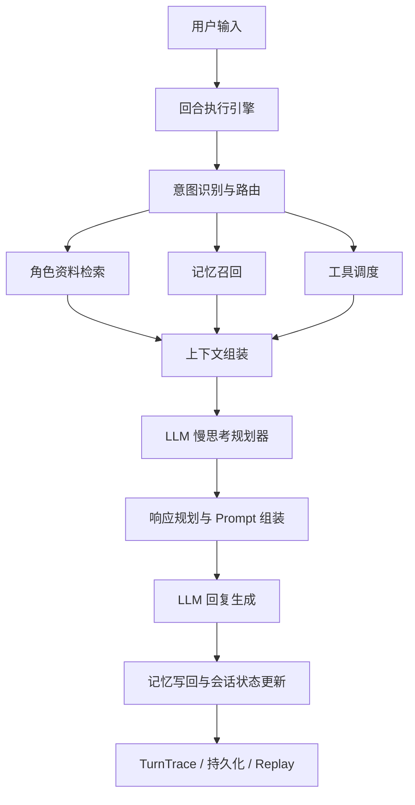

# WitchTalk

> 让记忆与情绪在安静的角落慢慢生长。

WitchTalk 是一个面向 **角色扮演、情感陪伴与多轮互动** 的会话型 AI Agent 项目。  
它的核心思路，是把“角色知识、记忆、情绪、关系、上下文、工具”组织成一条完整的会话链路，让系统先判断这轮应该怎么处理，再决定这轮应该怎么说。

当前版本已经完成了一轮比较完整的架构重构。  
现在的 WitchTalk 更接近一套 **ReAct 风格的角色 Agent Runtime**：

- 有显式的回合执行器（Turn Harness）
- 有分层记忆与会话上下文治理
- 有 LLM 驱动的慢思考规划层
- 有工具调度与 observation 回流
- 有状态持久化、trace、replay 和 regression

一句话概括：

**WitchTalk 会先理解输入、再调度资料与记忆、再做结构化规划、最后生成角色化回复，并把这一轮互动写回系统状态。**

---

## 这个项目在解决什么问题

很多“角色聊天”项目有两个常见问题：

1. 角色感只靠 prompt 硬撑，聊几轮之后容易漂  
2. 一旦涉及设定问答、情绪陪伴、现实信息、多轮记忆，就很容易互相干扰

WitchTalk 的设计思路是把这些问题拆开处理：

- **角色资料** 不直接等于 prompt，先进入知识层
- **记忆**    采用分层管理的设计
- **情绪和关系** 作为显式状态参与决策
- **上下文** 采用分层选择，而不是整包堆进模型
- **慢思考** 由 LLM 在结构化约束下完成规划

所以它更像一个“会先判断、再调度、再回答、再更新状态”的角色化 Agent 系统，而不只是一个模仿角色说话的 Prompt 项目。

---

## 设计思想

### 1. 角色是一套可调用知识

角色资料上传后，会先经过：

- 解析与清洗
- 角色模板抽取
- story/source 分段
- 向量化与索引构建

这样系统面对不同问题时，能只拿当前真正需要的角色证据，不必每次都背整本设定集。

---

### 2. 记忆是一套多层机制

当前实现里，记忆相关结构已经明确拆开：

#### Working Memory
当前会话的活跃工作集，用来维持短期连续性。

包括：

- `active_topics`
- `active_threads`
- `recent_emotion_summary`
- `recent_relation_summary`
- `recent_tool_summary`
- `pinned_facts`

它解决的是“刚刚说到哪了”“现在还在延续什么”。

#### Episodic Memory
保存具体互动事件，支持 recall reinforce 与 strength decay。

它解决的是“过去发生过什么值得再想起来”。

#### Semantic Memory
保存更稳定的长期信息，例如：

- 用户长期偏好
- 稳定互动模式
- 关系摘要

当前支持 merge 和 relationship summary rewrite。

#### Relation State
这一层由系统直接维护，是显式状态，不走检索召回。

当前主要包括：

- `stage`
- `trust`
- `affection`
- `familiarity`
- `guidance`

它决定的是边界、亲密度和表达分寸。

#### Session Context
它不完全等于 memory，但与会话连续性紧密相关。

包括：

- `active_topics`
- `active_thread_summaries`
- `archived_thread_summaries`
- `relation_summary`
- `emotion_summary`
- `pinned_facts`

它解决的是“这一整段会话现在处在什么状态”。

所以如果要准确描述现在的实现，不应该再说“记忆只有三层”，而应该理解为：

**Working Memory + Episodic Memory + Semantic Memory + Relation State，并配有独立的 Session Context。**

---

### 3. 上下文需要治理

WitchTalk 当前把上下文显式拆成三层：

#### Stable Context
稳定不变的角色核心信息，例如：

- 角色身份核心
- 风格底色
- 回答边界规则

#### Session Context
当前会话持续活跃的信息，例如：

- 活跃主题
- 活跃线程摘要
- 已归档线程摘要
- 当前关系摘要
- 当前情绪摘要
- pinned facts

#### Turn Context
当前这一轮特有的信息，例如：

- 用户输入
- 当前 response mode
- 本轮选中的证据来源
- evidence preview
- recent dialogue

此外还有 `ContextSelector`，会在进入生成前按 mode 过滤材料。  
例如：

- `external` 模式下不会把 memory 当现实事实
- `story` 模式下不会让 recent dialogue 抢主证据
- `self_intro` 更偏 identity / persona

系统不会把所有上下文一股脑送给模型，而是会先决定这轮到底该看到什么。

---

### 4. 慢思考不再是固定模板

当前版本已经移除了旧的规则式 slow thoughts。  
现在的做法是：

- 程序提供结构化输入
- LLM 输出结构化 planning result

planner 会读取：

- 用户输入
- 最近几轮对话摘要
- session context
- working memory
- relation state
- intent / route snapshot
- tool 状态
- persona decision card
- 当前命中的 persona / story evidence 摘要

planner 输出包括：

- `surface_intent`
- `latent_need`
- `response_goal`
- `response_mode_override`
- `persona_focus_override`
- `tone_register`
- `evidence_status`
- `intimacy_ceiling / warmth / directness`

这里的人设输入是一张 **persona decision card**，不是整份设定原文。  
它表达的是“角色如何做决策”的抽象偏置，不绑定某个角色的专属硬规则脚本。

这保证了系统既能保留角色差异，又不会因为某个具体角色而失去泛用性。

---

### 5. 角色回复建立在证据约束上

当前回复生成已经拆成几层：

- stable prompt
- response planner
- evidence pack
- prompt composer

系统会根据 mode 选择不同证据：

- `self_intro`
- `story`
- `persona_fact`
- `value`
- `external`
- `emotional`
- `casual`

证据不足时，系统会优先保守作答，避免直接补写新故事、新经历或新设定。

---

### 6. 工具是可注册、可扩展的

工具层当前采用：

- `Tool Registry`
- `ToolRouter`
- `ToolExecutionReport`

已接入能力包括：

- 天气查询
- 联网搜索

工具结果不只是“查完就塞给模型”，还会声明：

- `tool_type`
- `inject_policy`
- `persist_policy`

例如 `external_fact` 当前会按 `session_only` 处理，避免现实信息污染长期角色记忆。

这意味着后续扩展地图、日历、网页阅读、百科检索、文档读取等能力时，不需要重写主链路，只需要接入同一套注册与调度机制。

---

## 一轮对话是怎么跑的

一轮完整对话大致经过这条链路：

**用户输入 -> 意图/路由 -> 资料召回 -> 记忆召回 -> 工具调用 -> 上下文治理 -> LLM Planner -> Prompt 组装 -> LLM 回复 -> 记忆/状态写回 -> Trace / Persistence**

下面是当前主链路的结构示意：



这条链本质上就是一个工程化的 ReAct 闭环：

**Reasoning -> Action -> Observation -> Response -> State Update**

不过这套闭环面向的是角色陪伴和多轮互动，不是代码任务。

---

## 当前已经做到的能力

### 角色资料学习

- 上传角色文本资料
- 解析与清洗
- 预览与确认
- 写入角色知识层与索引

### 多轮角色对话

- 自我介绍
- 设定问答
- 故事问答
- 价值观表达
- 情绪支持
- 记忆连续性问答
- 现实信息回答

### 运行时能力

- turn harness
- turn trace
- replay
- runtime regression
- full regression
- drift / diff 基础诊断

---

## 当前实现边界

这一版已经完成主链路重构，但也仍然有明确边界：

- 情绪模式下 planner 与最终 generation 仍有继续对齐空间
- story 能力依赖真实 story corpus 的覆盖质量
- semantic consolidation 还能继续细化
- archived thread 生命周期策略还可以更成熟
- regression case 还可以继续扩充

当前版本已经走过概念验证阶段，但仍然有继续打磨的空间。

---

## 技术栈

| 模块 | 技术选型 |
|------|----------|
| Web 服务 | Flask |
| 检索 | Qdrant Local (HNSW) + BM25 (`rank-bm25`) |
| Embedding | Mistral Embed / OpenAI Embedding |
| LLM 接入 | Mistral / OpenAI / OpenAI-compatible |
| 情绪 / 关系 | PAD / OCC + 多轮状态管理 |
| 工具层 | 可注册 Tool Registry + Tool Router |
| 前端 | HTML + 原生 JS |

---

## 快速上手

**环境要求：** Python 3.11+

### 1. 安装依赖

```bash
# macOS / Linux
python3 -m venv .venv
source .venv/bin/activate
pip install -r requirements.txt
```

```powershell
# Windows
python -m venv .venv
.\.venv\Scripts\activate
pip install -r requirements.txt
```

### 2. 配置 `.env`

在项目根目录创建 `.env` 文件。

**Mistral**

```env
LLM_PROVIDER="mistral"
LLM_API_KEY="your_api_key"
LLM_CHAT_MODEL="mistral-medium-latest"
LLM_EMBEDDING_MODEL="mistral-embed"
```

**OpenAI**

```env
LLM_PROVIDER="openai"
LLM_API_KEY="your_api_key"
LLM_CHAT_MODEL="gpt-4.1-mini"
LLM_EMBEDDING_MODEL="text-embedding-3-small"
```

**兼容接口**

```env
LLM_PROVIDER="openai_compatible"
LLM_API_KEY="your_api_key"
LLM_BASE_URL="https://your-endpoint/v1"
LLM_CHAT_MODEL="your-chat-model"
LLM_EMBEDDING_MODEL="your-embedding-model"
```

### 3. 启动

```bash
python app.py
```

浏览器打开 [http://127.0.0.1:5000](http://127.0.0.1:5000)

---

## 使用流程

1. 上传角色资料
2. 预览并确认角色模板与关键词
3. 写入知识层与索引
4. 开始多轮对话

建议资料尽量包含：

- 身份背景
- 性格特征
- 说话风格
- 重要经历
- 代表性故事片段

资料越完整，角色一致性和 story grounding 会越稳定。

---

## 效果展示


---

## 项目结构

```text
WitchTalk/
├── app.py
├── main.py
├── runtime/                # SessionRuntime / TurnEngine / TurnTrace
├── reasoning/              # planner / persona decision card / emotion state machine
├── prompting/              # stable prompt / response planner / prompt composer
├── context/                # session context / selector / compactor / selected view
├── knowledge/              # persona ingest / persona RAG / context service
├── memory/                 # working / episodic / semantic / relation memory
├── tools/                  # registry / tool router / intent extractor
├── persistence/            # transcript / derived state / trace / replay
├── evaluation/             # runtime regression / full regression / diagnostics
├── diagnostics/            # trace diff / turn logger
├── response_generator.py
├── llm.py
├── templates/
├── static/
└── uploads/
```

---

## 常见问题

**为什么刚开始聊天时，角色的好感、熟悉度或亲密感变化不明显？**  
这是当前设计的正常表现。关系状态是渐进更新的，前几轮更偏向建立基础印象和互动边界，不会一开始就出现大幅亲密波动。随着对话轮次增加、互动更稳定，角色的语气、分寸和关系反馈才会逐渐拉开差异。

**为什么有时回答会比较保守，甚至不愿意多讲？**  
当 story、persona 或 external evidence 不足时，系统会优先收束，避免补写新细节。对于角色项目来说，保守回答通常比“编得很像真的”更重要。

**为什么有时角色能接住最近几轮，但对更久之前的内容表现没那么稳定？**  
因为当前实现把 working memory、episodic memory、semantic memory 和 relation state 分开处理。短期连续性、事件回忆和长期稳定印象走的是不同路径，短期内容通常更容易被稳定命中。

**为什么故事类回答有时不够丰富？**  
故事模式强依赖真实 story evidence。如果上传资料里的代表性故事片段较少、粒度太粗，系统会宁可保守，也不会主动补写完整剧情。补充更明确的事件片段、对白和关键转折，通常会明显改善 story 表现。

**为什么角色前后语气有时会有细微变化？**  
当前回复会同时受到角色资料、关系状态、情绪状态、working memory 和 planner 决策影响。轻微变化是正常的；如果波动过大，通常优先检查角色资料是否冲突、样本风格是否过杂，或者最近几轮对话是否把系统带进了新的互动模式。

**为什么现实信息相关的回答偶尔会失败或不完整？**  
现实信息依赖工具调用和外部服务。如果天气或搜索工具没有返回足够结果，系统只会回答已确认的部分，或者直接收束，而不会把未知部分编完整。

**工具结果会不会污染角色的长期记忆？**  
默认不会。外部现实信息通过 tool policy 控制，通常只保留在 session 层，不会直接写进长期角色记忆。

---

## License

详见 [LICENSE](./LICENSE)。
