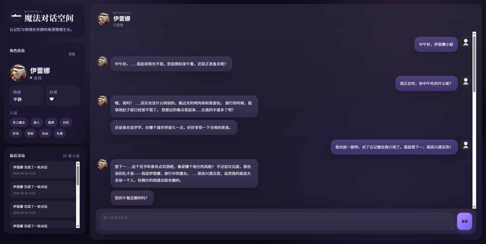
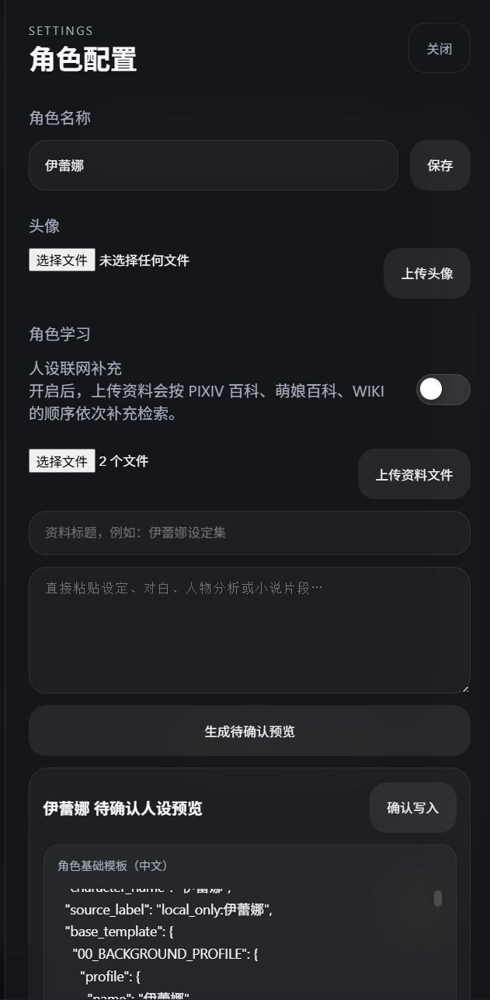
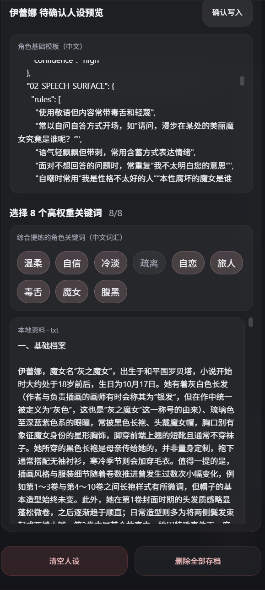

# Wetalk

Wetalk 是一个面向情感陪伴与角色扮演场景的 AI Agent 项目。  
它的目标不是做一个普通聊天机器人，而是让模型先学习角色资料，再以稳定的人格、语气和说话方式与用户持续对话。

项目支持：
- 上传角色设定、故事资料或人物说明文本
- 自动生成角色基础模板与可选关键词
- 基于角色知识库进行检索式回复
- 在需要时调用天气查询、联网搜索等工具
- 在多轮对话中保持相对稳定的角色风格、情绪延续与上下文衔接

## 适用场景

Wetalk 适合以下使用方式：
- 角色扮演聊天
- 角色资料学习与整理
- 基于人设的沉浸式陪伴对话
- 为特定角色构建具备记忆与工具能力的对话智能体

## 功能概览

### 1. 角色学习

你可以上传：
- 角色设定文档
- 故事资料
- 人物背景介绍
- 纯文本整理稿

系统会先生成一份待确认预览，通常包括：
- 角色基础模板
- 关键词候选
- 角色背景摘要
- 本地资料与可选联网补充结果

确认后，系统会把角色资料写入知识库，用于后续对话检索。

### 2. 角色化对话

系统会尽量区分两件事：
- 角色底色：决定“怎么说”
- 检索证据 / 工具结果：决定“说什么”

这意味着：
- 问角色身份、经历、故事时，会优先检索角色资料
- 问天气、现实知识、现实人物时，会优先走工具和联网搜索
- 普通闲聊则尽量延续最近对话和角色说话风格

### 3. 多轮记忆与上下文

系统包含短期工作记忆和长期记忆机制，用于帮助角色在多轮对话中更自然地承接：
- 最近说过什么
- 用户刚才的语气和情绪
- 当前对话主题
- 部分长期偏好或互动痕迹

### 4. 工具能力

当前已支持：
- 天气查询
- 网络搜索

工具结果不会直接原样输出，而是会尽量结合角色语气进行表达。

## 运行环境

推荐环境：
- Python 3.11 及以上
- Windows / macOS / Linux
- 一个可用的 LLM API Key

## 安装

在项目根目录执行：

### Windows

```powershell
cd 你的项目文件夹
python -m venv .venv
.\.venv\Scripts\activate
pip install -r requirements.txt
```

### macOS / Linux

```bash
cd 你的项目文件夹
python3 -m venv .venv
source .venv/bin/activate
pip install -r requirements.txt
```

## 配置 `.env`

在项目根目录创建 `.env` 文件。

### 使用 Mistral

```env
LLM_PROVIDER="mistral"
LLM_API_KEY="your_api_key"
LLM_CHAT_MODEL="mistral-medium-latest"
LLM_EMBEDDING_MODEL="mistral-embed"
```

### 使用 OpenAI

```env
LLM_PROVIDER="openai"
LLM_API_KEY="your_api_key"
LLM_CHAT_MODEL="gpt-4.1-mini"
LLM_EMBEDDING_MODEL="text-embedding-3-small"
```

### 使用兼容接口

```env
LLM_PROVIDER="openai_compatible"
LLM_API_KEY="your_api_key"
LLM_BASE_URL="https://your-endpoint/v1"
LLM_CHAT_MODEL="your-chat-model"
LLM_EMBEDDING_MODEL="your-embedding-model"
```

常用字段说明：
- `LLM_PROVIDER`：模型提供方
- `LLM_API_KEY`：API Key
- `LLM_BASE_URL`：兼容接口地址，可选
- `LLM_CHAT_MODEL`：聊天模型名
- `LLM_EMBEDDING_MODEL`：向量模型名

## 启动项目

```powershell
cd 你的项目路径
python app.py
```

启动后在浏览器打开：

[http://127.0.0.1:5000](http://127.0.0.1:5000)

## 使用流程

### 第一步：上传角色资料

在 Web 页面中上传资料文件，或直接粘贴角色设定文本。

建议资料尽量包含：
- 身份背景
- 性格特征
- 说话风格
- 重要经历
- 故事片段

### 第二步：预览并确认

系统会生成待确认预览。你可以查看：
- 角色基础模板
- 候选关键词
- 本地资料整理结果
- 可选联网补充摘要

确认后，资料会正式写入角色知识库。

### 第三步：开始对话

完成确认后即可开始聊天。常见问法包括：
- “请自我介绍一下”
- “讲一个你的故事”
- “你怎么看这件事”
- “东京今天天气怎么样”
- “你认识某某吗”

## 对话逻辑说明

系统大致会这样处理问题：

1. 先判断用户当前问题属于哪一类  
2. 决定是否需要检索角色资料、长期记忆或外部工具  
3. 把命中的证据整理进本轮上下文  
4. 再按角色的说话方式输出答案

简单来说：
- 角色相关问题：优先查角色资料
- 现实信息问题：优先查工具和网络
- 情绪互动：优先接住情绪，再继续对话
- 普通闲聊：优先延续上下文和角色底色

## 项目结构

如果你只是普通使用者，可以跳过这一节。  
如果你需要二次开发，可以从这些入口开始看：

```text
Ireina/
├── app.py                  # Web 入口
├── main.py                 # 主编排器
├── llm.py                  # 模型与 embedding 调用
├── response_generator.py   # 回复生成
├── persona_prompting.py    # 角色分析 / 演员 Prompt
├── knowledge/              # 人设学习、预览、RAG
├── memory/                 # 记忆系统
├── tools/                  # 天气 / 搜索等工具
├── context/                # 上下文装配
├── templates/              # 前端页面模板
├── static/                 # 前端静态资源
└── uploads/                # 上传资料目录
```

## 效果展示



<p align="center">
  
  
</p>

## 常见问题

### 1. 启动时提示 API 校验失败怎么办？

如果日志中出现模型服务拥挤、429 或容量不足，通常不是本地代码错误，而是模型服务端临时限流。  
项目会尝试自动重试或切换备用模型。

### 2. 上传资料后回答不理想怎么办？

建议优先检查：
- 资料是否足够完整
- 故事内容是否清晰
- 角色设定是否存在明显冲突
- 预览关键词是否合理

必要时可以重新上传并重新确认角色资料。

### 3. 为什么有时回答会偏保守？

系统会尽量避免在没有证据时编造角色经历或现实事实，所以当资料不足或检索不到内容时，回答会更谨慎。

## 注意事项

- 如果你修改了角色 Prompt、知识库结构或角色资料，建议重新生成并确认一次预览。
- 如果页面状态和后端结果不一致，建议刷新浏览器页面后重试。
- 上传的资料质量会直接影响角色学习效果和后续对话表现。

## License

本项目根目录包含 [LICENSE](./LICENSE) 文件，请按对应许可使用。
