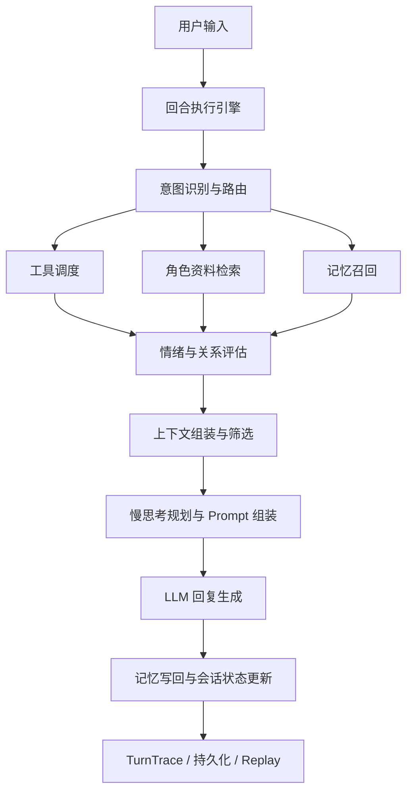

# WitchTalk

> 让记忆与情绪在安静的角落慢慢生长。

WitchTalk 是一个面向 **角色扮演、情感陪伴与多轮互动** 的会话型 AI Agent 项目。

它希望解决几件事：

- 角色在多轮对话里保持稳定的人设和说话方式
- 用户前面说过的话、当前关系状态和情绪氛围能够延续
- 问到角色设定和故事时，回答尽量有资料依据
- 需要现实信息时，可以调用外部工具，但不会破坏角色感

---

## 这个项目能做什么

当前版本已经具备这些能力：

- 上传角色资料并整理成角色知识
- 多轮角色对话
- 角色设定问答
- 故事问答
- 情绪陪伴
- 现实信息查询
- 记忆连续性问答
- 回合轨迹记录、回放和基础回归检查

---

## 使用流程

1. 上传角色资料
2. 预览并确认角色模板与关键词
3. 写入知识层与索引
4. 开始多轮对话

建议资料尽量包含：

- 身份背景
- 性格特征
- 说话风格
- 重要经历
- 代表性故事片段

资料越完整，角色一致性和 story grounding 会越稳定。

---

## 效果展示


---

## 快速上手

**环境要求：** Python 3.11+

### 1. 安装依赖

```bash
# macOS / Linux
python3 -m venv .venv
source .venv/bin/activate
pip install -r requirements.txt
```

```powershell
# Windows
python -m venv .venv
.\.venv\Scripts\activate
pip install -r requirements.txt
```

### 2. 配置 `.env`

在项目根目录创建 `.env` 文件。

**Mistral**

```env
LLM_PROVIDER="mistral"
LLM_API_KEY="your_api_key"
LLM_CHAT_MODEL="mistral-medium-latest"
LLM_EMBEDDING_MODEL="mistral-embed"
```

**OpenAI**

```env
LLM_PROVIDER="openai"
LLM_API_KEY="your_api_key"
LLM_CHAT_MODEL="gpt-4.1-mini"
LLM_EMBEDDING_MODEL="text-embedding-3-small"
```

**兼容接口**

```env
LLM_PROVIDER="openai_compatible"
LLM_API_KEY="your_api_key"
LLM_BASE_URL="https://your-endpoint/v1"
LLM_CHAT_MODEL="your-chat-model"
LLM_EMBEDDING_MODEL="your-embedding-model"
```

### 3. 启动

```bash
python app.py
```

浏览器打开 [http://127.0.0.1:5000](http://127.0.0.1:5000)

---

## 项目说明

WitchTalk 的运行链路大致可以理解成：

**角色资料学习 → 资料切分与索引 → 意图判断 → 工具调度 → 资料与记忆召回 → 情绪和关系评估 → 上下文选择 → Prompt 规划与生成 → 状态写回**

资料进入系统后，会分成两部分：

- 一部分整理成角色基础模板，用来稳定角色身份、说话方式、关系边界和表达风格
- 一部分切成可检索资料片段，用来回答具体设定和故事问题

系统在对话过程中会维护几类状态：

- 当前会话的工作记忆
- 具体互动事件
- 较稳定的长期印象
- 关系状态和情绪状态

这些信息不会被一股脑塞进 Prompt。系统会先判断当前轮是什么任务，再决定使用哪些资料、哪些记忆、哪些工具结果，以及哪些信息需要压缩或屏蔽。

---

## 技术设计

如果从工程结构看，这个项目主要包括几块：

### 角色资料学习

- 资料先转成 Markdown
- 再按结构和语义切分
- 形成角色基础模板和可检索资料库

### 检索

- 本地 Qdrant 向量检索
- BM25 关键词检索
- 两者融合，处理语义相似和专有名词命中

### 记忆

- 短期工作记忆
- 事件记忆
- 稳定记忆
- 关系状态

### 情绪与关系

- 连续情绪状态
- 可解释的情绪判断
- trust / affection / familiarity / stage 持续更新

### 工具

- 可注册工具接入
- 当前已接入天气查询和联网搜索
- 工具结果带注入策略和持久化策略

### 执行框架

- 回合执行器
- 上下文选择与压缩
- 规划层与生成层分离
- trace / replay / regression

---

## 一轮对话是怎么跑的

一轮完整对话大致经过这条链路：

**用户输入 → 意图判断 → 工具判断 → 资料召回 → 记忆召回 → 情绪和关系评估 → 上下文治理 → 规划与 Prompt 组装 → LLM 回复 → 记忆/状态写回 → Trace / Persistence**

下面是当前主链路的结构示意：



---

## 项目结构

```text
WitchTalk/
├── app.py
├── main.py
├── runtime/                # SessionRuntime / TurnEngine / TurnTrace
├── reasoning/              # planner / persona decision card / emotion state machine
├── prompting/              # stable prompt / response planner / prompt composer
├── context/                # session context / selector / compactor / selected view
├── knowledge/              # persona ingest / persona RAG / context service
├── memory/                 # working / episodic / semantic / relation memory
├── tools/                  # registry / tool router / intent extractor
├── persistence/            # transcript / derived state / trace / replay
├── evaluation/             # runtime regression / full regression / diagnostics
├── diagnostics/            # trace diff / turn logger
├── response_generator.py
├── llm.py
├── templates/
├── static/
└── uploads/
```

---

## 常见问题

**为什么刚开始聊天时，角色的好感、熟悉度或亲密感变化不明显？**  
这是当前设计的正常表现。关系状态是渐进更新的，前几轮更偏向建立基础印象和互动边界，不会一开始就出现大幅亲密波动。随着对话轮次增加、互动更稳定，角色的语气、分寸和关系反馈才会逐渐拉开差异。

**为什么有时回答会比较保守，甚至不愿意多讲？**  
当故事证据、角色证据或外部证据不足时，系统会优先收束，避免补写新细节。对于角色项目来说，保守回答通常比“编得很像真的”更重要。

**为什么有时角色能接住最近几轮，但对更久之前的内容表现没那么稳定？**  
因为当前实现把工作记忆、事件记忆、稳定记忆和关系状态分开处理。短期连续性、事件回忆和长期稳定印象走的是不同路径，短期内容通常更容易被稳定命中。

**为什么故事类回答有时不够丰富？**  
故事模式强依赖真实 story evidence。如果上传资料里的代表性故事片段较少、粒度太粗，系统会宁可保守，也不会主动补写完整剧情。补充更明确的事件片段、对白和关键转折，通常会明显改善 story 表现。

**为什么角色前后语气有时会有细微变化？**  
当前回复会同时受到角色资料、关系状态、情绪状态、工作记忆和规划层决策影响。轻微变化是正常的；如果波动过大，通常优先检查角色资料是否冲突、样本风格是否过杂，或者最近几轮对话是否把系统带进了新的互动模式。

**为什么现实信息相关的回答偶尔会失败或不完整？**  
现实信息依赖工具调用和外部服务。如果天气或搜索工具没有返回足够结果，系统只会回答已确认的部分，或者直接收束，而不会把未知部分编完整。

**工具结果会不会污染角色的长期记忆？**  
默认不会。外部现实信息通过 tool policy 控制，通常只保留在 session 层，不会直接写进长期角色记忆。

---

## License

详见 [LICENSE](./LICENSE)。
